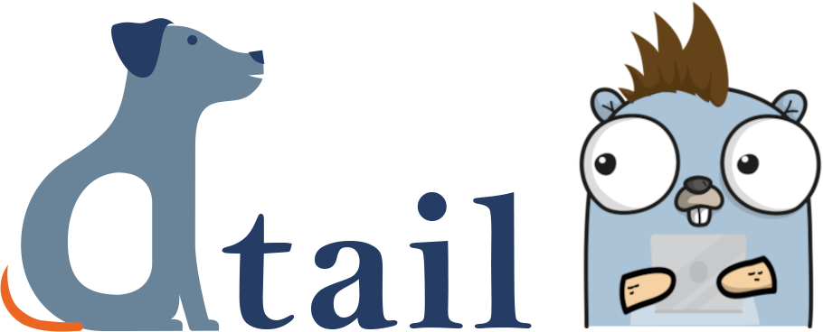

DTail
=====

     

DTail (a distributed tail program) is a DevOps tool for engineers programmed in Google Go for following (tailing), catting and grepping (including gzip and zstd decompression support) log files on many machines concurrently. An advanced feature of DTail is to execute distributed mapreduce aggregations across many machines.

For secure authorization and transport encryption the SSH protocol is used. Furthermore, DTail respects the UNIX file system permission model (traditional on all Linux/UNIX variants and also ACLs on Linux based operating systems).

The DTail binary operate in either client or in server mode. The DTail server must be installed on all server boxes involved. The DTail client (possibly running on a regular Laptop) is used interactively by the user to connect to the servers concurrently. That currently scales to multiple thousands of servers per client.

If you like what you see [look here for more examples](doc/examples.md)!

Installation and Usage
======================

* For simplest setup please follow the [Quick Starting Guide](doc/quickstart.md).
* For a more sustainable setup please follow the [Installation Guide](doc/installation.md).
* Please also have a look at the [Usage Examples](doc/examples.md).

More
====

* [How to contribute](CONTRIBUTING.md)
* [Code of conduct](CODE_OF_CONDUCT.md)
* [Licenses](doc/licenses.md)

Credits
=======

* DTail was created by **Paul Buetow** *<pbuetow@mimecast.com>*
* Thank you to **Vlad-Marian Marian** for creating the DTail (dog) logo.
* The Gopher was generated at https://gopherize.me
