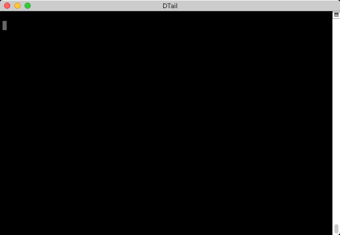
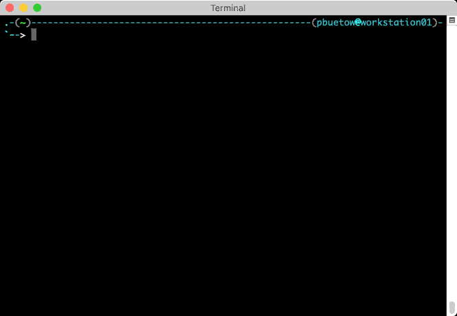

Examples
========

This page demonstrate the basic usage of DTail. Please also see ``dtail --help`` for more available options.

# How to use ``dtail``

## Tailing logs

The following example demonstrates how to follow logs of multiple servers at once. The server list is provided as a flat text file. The example filters all logs containing the string ``STAT``. Any other Go compatible regular expression can be used instead of ``STAT``.

```shell
% dtail --servers serverlist.txt --files "/var/log/service/*.log" --regex STAT
```


## Aggregating logs

To run ad-hoc mapreduce aggregations on newly written log lines you also must add a query. This example follows all remote log lines and prints out every 5 seconds the top 10 servers with most average free memory according to the logs. To run a mapreduce query across log lines written in the past please use the ``dmap`` command instead.

```shell
% dtail --servers serverlist.txt  \
    --query 'select avg(memfree), $hostname from MCVMSTATS group by $hostname order by avg(memfree) limit 10 interval 5' \
    --files '/var/log/service/*.log'
```

In order for mapreduce queries to work you have to make sure that your log format is supported by DTail. You can either use the ones which are already defined in ``internal/mapr/logformat`` or add an extension to support a custom log format.



# How to use ``dcat``

The following example demonstrates how to cat files (display the whole content of the files) of multiple servers at once. The servers are provided as a comma separated list this time.

```shell
% dcat --servers serv-011.lan.example.org,serv-012.lan.example.org,serv-013.lan.example.org \
    --files /etc/hostname
```


# How to use ``dgrep``

The following example demonstrates how to grep files (display only the lines which match a given regular expression) of multiple servers at once. In this example we look after the swap partition in ``/etc/fstab``. We do that only on the first 20 servers from ``serverlist.txt``. ``dgrep`` is also very useful for searching log files of the past.

```shell
% dgrep --servers <(head -n 20 serverlist.txt) \
    --files /etc/fstab \
    --regex swap
```


# How to use ``drun``

The following example demonstrates how to execute a command on multiple machines remotely:

```shell
% drun --servers <(head -n 30 serverlist.txt) \
    --command uptime
```



# How to use ``dmap``

To run a mapreduce aggregation over logs written in the past the ``dmap`` command can be used. For example the following command aggregates all mapreduce fields of all the logs and calculates the average memory free grouped by day of the month, hour, minute and the server hostname. ``dmap`` will print interim results every few seconds. The final result however will be written to file ``mapreduce.csv``.

```shell
% dmap --servers serv-011.lan.example.org,serv-012.lan.example.org,serv-013.lan.example.org,serv-021.lan.example.org,serv-022.lan.example.org,serv-023.lan.example.org \
    --query 'select avg(memfree), $day, $hour, $minute, $hostname from MCVMSTATS group by $day, $hour, $minute, $hostname order by avg(memfree) limit 10 outfile mapreduce.csv' \
    --files "/var/log/service/*.log"
```

Remember: In order for that to work you have to make sure that your log format is supported by DTail. You can either use the ones which are already defined in ``internal/mapr/logformat`` or add an extension to support a custom log format.


